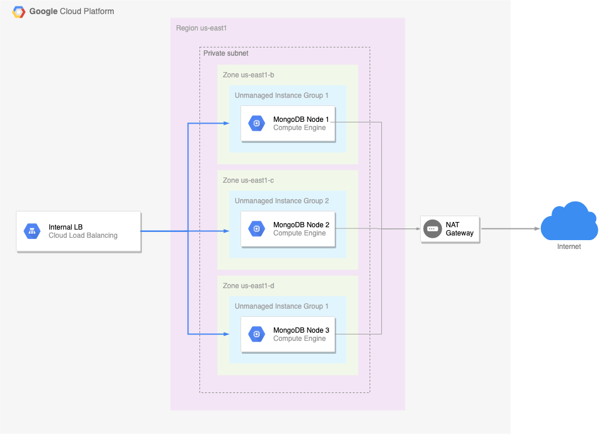

# Creation of a MongoDB cluster on GCP using Terraform and Ansible

The architecture is the following:

The principle will be to create the infrastructure with Terraform:
* 3 Compute Engine instances
* 3 unmanaged instance groups
* 1 internal load balancer (which will create a healthcheck, a forwarding rule, some firewall rules behing the scene)
*  and to build the inventory list for the next step

Then, configure the nodes with Ansible by using 2 roles for$
* installing MongoDB  on all nodes
* initialize the cluster on the leader node

The ingredients will be the following:
- GCP
- Terraform 0.13
- Ansible 2.6
- MongoDB 4.4

Fore more details, you can check the tutorial on this [link](https://medium.com/@belougatech/create-a-mongodb-cluster-in-2-command-lines-with-gcp-terraform-ansible-6b706c2d57d)

